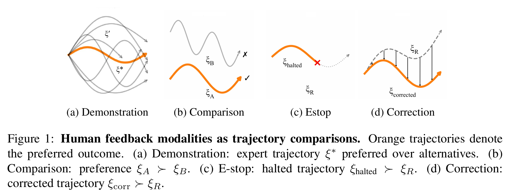
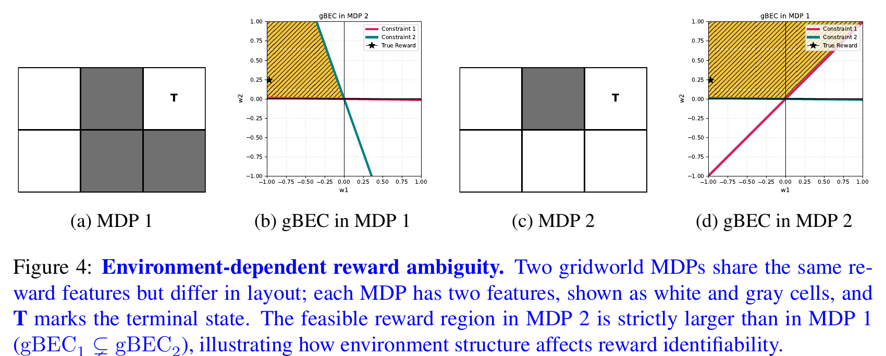
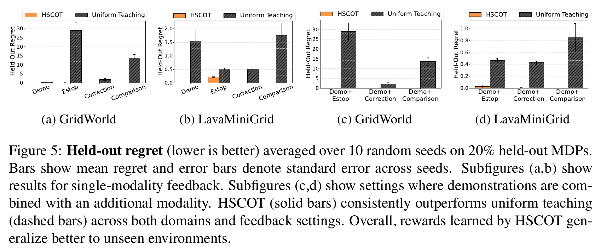
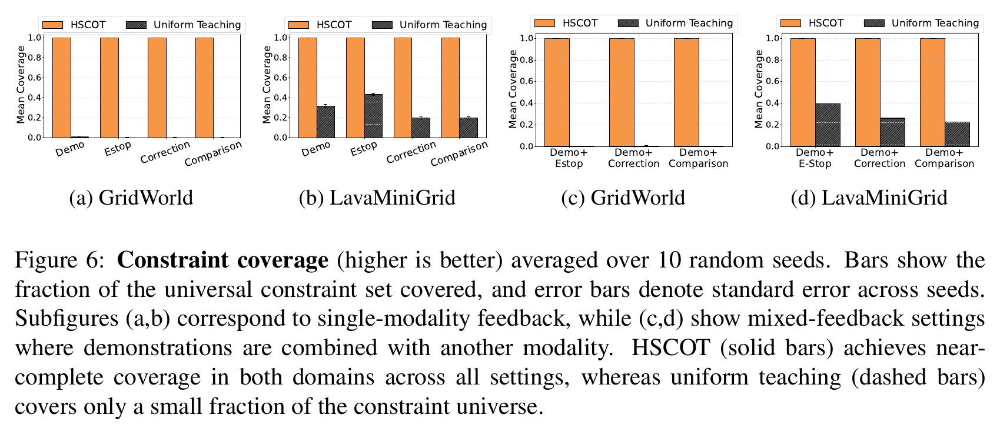

# Multi-Modal, Multi-Environment Machine Teaching for Robust Reward Learning

Code for the paper **"Multi-Modal, Multi-Environment Machine Teaching for Robust Reward Learning"**,
accepted at RLC 2026, to be published in RLJ.

**Authors:** Ali Larian, Qian Lin, Chang Zong Wu, Daniel S. Brown

## Introduction

Inverse reinforcement learning (IRL) infers a reward function from human feedback, but
rewards taught in a single environment tend to overfit to that environment's dynamics and
fail to generalize elsewhere. This repo studies **machine teaching for reward learning
across multiple environments and multiple feedback modalities**: demonstrations,
pairwise comparisons, corrections, and emergency-stops (E-stops). Each modality can be
viewed as a trajectory comparison — the teacher indicates a preferred trajectory over an
alternative, which induces a linear constraint on the reward parameters:

<p align="center">
  
</p>

The teacher (human or expert policy) is assumed to select feedback in a
*reward-rational* way, so demonstrations, comparisons, corrections, and E-stops all reduce
to the same underlying constraint interpretation, just with different structure (e.g.
demonstrations and corrections share an initial state with their alternative; comparisons
can contrast arbitrary trajectory pairs; E-stops only compare a trajectory against a
halted prefix of itself). The paper analyzes how this structural difference affects how
much each modality constrains the feasible reward region, in both the unlimited-data and
finite-budget regimes, and builds a multi-environment teaching algorithm on top of it.

## Results

### Theoretical results

Reward identifiability is **environment-dependent**: even *unlimited* feedback collected
in a single MDP can leave residual reward ambiguity that only becomes visible once the
agent is deployed in a different environment with different dynamics. The figure below
illustrates this with two GridWorld MDPs that share the same reward features but differ
in layout — the feasible reward region (generalized behavioral equivalence class, gBEC)
recovered from MDP 2 alone is strictly larger than the one recovered from MDP 1 alone
(`gBEC_1 ⊊ gBEC_2`), so teaching in only one of the two environments leaves reward
ambiguity that the other would have resolved:

<p align="center">
  
</p>

We also show that, in the unlimited-data regime, comparison feedback imposes strictly
stronger global constraints on the feasible reward region than demonstrations,
corrections, or E-stops — while under tight finite budgets, demonstrations are the most
constraint-efficient per query, since each one implicitly encodes many optimality
constraints at once.

### Algorithm and numerical results

Motivated by these results, we introduce **Hierarchical Set Cover Optimal Teaching
(HSCOT)**: a two-stage greedy algorithm that (1) selects a small set of training
environments whose dynamics expose complementary reward constraints, then (2) selects
low-cost feedback queries within those environments to efficiently cover the resulting
constraint set. This is implemented in `teaching/two_stage_scot.py` and
`teaching/two_stage_scot_minigrid.py`, and evaluated end-to-end by the scripts in
`experiments/`.

On GridWorld and MiniGrid LavaWorld, HSCOT is compared against a uniform-teaching
baseline under identical feedback budgets, evaluating the learned reward's regret on
held-out environments never seen during teaching:

<p align="center">
  
</p>

HSCOT also recovers a much larger fraction of the full constraint set achievable across
the training environments, under the same query budget:

<p align="center">
  
</p>

HSCOT consistently achieves lower held-out regret, near-complete constraint coverage, and
uses fewer environments than uniform teaching to do it — see the paper for the full
numerical results, including the mixed-modality (demonstrations + one other feedback
type) setting and the per-environment teaching maps in the appendix.

## Repository layout

```
agent/              Q-learning / value-iteration agent used to solve MDPs
experiments/        Environment classes (GridWorldMDPFromLayoutEnv, ...) and the two
                    top-level experiment-runner scripts (HSCOT vs. random baseline,
                    for GridWorld and MiniGrid LavaWorld)
teaching/           SCOT / HSCOT set-cover teaching algorithms
reward_learning/    Reward-learning models (BIRL variants, max-margin/atomic IRL)
utils/              Feedback simulation, constraint derivation, LP redundancy removal,
                    successor features, environment generators
configs/            Example experiment config (BIRL hyperparameters)
slurm/              SLURM batch scripts for running the full experiment sweep on an
                    HPC cluster, plus a script to fetch results back locally
results_chpc/       Where cluster results land locally (raw JSON/PNG/PDF outputs are
                    gitignored and regenerable; the two analysis/plotting scripts that
                    read them, visualize_main.ipynb and visualize_mini_seeds.py, are
                    tracked)
appendix/           Standalone notebooks reproducing supplementary paper figures
                    (environment-dependent gBEC illustration; per-budget feasible-region
                    volume sweep across feedback modalities)
test/               Unit tests
```

## Installation

Requires Python 3.10.

```bash
python3.10 -m venv .venv
source .venv/bin/activate
pip install -r requirements.txt
```

## Quick start (local, single run)

Run HSCOT vs. a random-teaching baseline on 6x6 GridWorld with demonstrations +
comparisons:

```bash
cd experiments
python two_stage_vs_random_lp.py \
  --n_envs 50 --mdp_size 6 --feature_dim 4 \
  --feedback demo pairwise \
  --total_budget 10000 --random_trials 10 --seed 1337 \
  --heldout-frac 0.2 --alloc_method uniform \
  --result_dir ../results_chpc/grid_mixed/demo_pairwise/seed_1337
```

Or on 8x8 MiniGrid LavaWorld with a single feedback modality:

```bash
cd experiments
python two_stage_scot_vs_random_minigrid_lp.py \
  --n_envs 50 --grid_size 8 --state_fraction 1.0 \
  --feedback correction \
  --total_budget 10000 --random_trials 10 --seed 1337 \
  --heldout_frac 0.2 --alloc_method uniform \
  --result_dir ../results_chpc/mini_single/correction/seed_1337
```

Valid `--feedback` values are `demo`, `pairwise` (comparison), `estop`, and `correction`.
Both scripts write one JSON file per run under `--result_dir`, with a `"methods"` dict
keyed by `"hscot"` (this method) and `"random"` (the baseline).

Run `python two_stage_vs_random_lp.py --help` / `python two_stage_scot_vs_random_minigrid_lp.py --help`
for the full list of flags (LP epsilon, allocation method, feedback-generation count, etc).

## Reproducing the paper's results

The reported results come from a sweep over 10 seeds x {single-modality, mixed-modality}
configs x {GridWorld, MiniGrid}, run in parallel via SLURM job arrays. You can reproduce
this either on an HPC cluster (recommended, matches the paper's budgets/wall-clock) or
locally (slower, same code path).

### Option A — on a SLURM/CHPC-style cluster

1. Clone the repo on the cluster and set up the venv as in Installation above, at
   `~/multienv-reward-teaching`.
2. Submit each job array from `slurm/`, passing your account/partition/cluster:
   ```bash
   cd ~/multienv-reward-teaching/slurm
   sbatch --account=<your-account> --partition=<your-partition> run_grid_single_lp.sh
   sbatch --account=<your-account> --partition=<your-partition> run_grid_mixed_lp.sh
   sbatch --account=<your-account> --partition=<your-partition> run_mini_single_lp.sh
   sbatch --account=<your-account> --partition=<your-partition> run_mini_mixed_lp.sh
   ```
   Each script is a 10-seed x {4 or 3}-config job array (see the header comment in each
   file for the exact task count) that writes results to
   `/scratch/general/nfs1/$USER/paper_results/<group>/<modality>/seed_<N>/*.json`.
   Adjust `#SBATCH` memory/time/CPU directives and the `module load python/3.10.3` line
   to match your cluster's environment if needed.
3. Fetch results back to your local checkout of this repo:
   ```bash
   cd slurm
   CHPC_USER=<your-cluster-username> ./fetch_results.sh --host=<ssh-alias-or-hostname>
   ```
   This uses an SSH ControlMaster connection so a 2FA prompt (if your cluster requires
   one) only needs to be answered once per session; results land in `results_chpc/`.

### Option B — locally

Run the same Python scripts directly per seed/modality (see Quick start above), writing
into the matching `results_chpc/<group>/<modality>/seed_<N>/` directory structure that
the visualization scripts expect. This reproduces the same computation as the cluster
jobs, just serially.

### Generating the figures

Once `results_chpc/` is populated (either fetched from a cluster or produced locally):

```bash
cd results_chpc
jupyter nbconvert --to notebook --execute --inplace visualize_main.ipynb   # main regret/coverage bar charts -> figures/*.pdf
python visualize_mini_seeds.py                                            # per-environment teaching maps -> mini_viz/seed_*/*.png
```

### Supplementary figures (appendix)

`appendix/gbec_two_mdps.ipynb` and `appendix/budget_sweep_analysis.ipynb` are
self-contained (they generate their own toy environments/data) and can be run directly:

```bash
cd appendix
jupyter nbconvert --to notebook --execute --inplace gbec_two_mdps.ipynb
jupyter nbconvert --to notebook --execute --inplace budget_sweep_analysis.ipynb
```

`gbec_two_mdps.ipynb` reproduces the environment-dependent reward ambiguity figure
(two GridWorld MDPs sharing features but differing in layout, showing
`gBEC(MDP1) ⊊ gBEC(MDP2)`). `budget_sweep_analysis.ipynb` reproduces the per-budget
feasible-region-volume sweep across feedback modalities.

## Tests

```bash
python -m pytest test/
```

Note: a handful of tests predate this codebase's later API changes and fail on `main`
independent of this repo's cleanup (e.g. `test_birl.py` / `test_reward_recovery_single_env.py`
reference a removed `compute_reward_for_trajectory` helper, and some `GridWorldMDPFromLayoutEnv`
env tests reference methods/kwargs the class no longer implements). These are pre-existing
and not something introduced by the reorganization described above.
